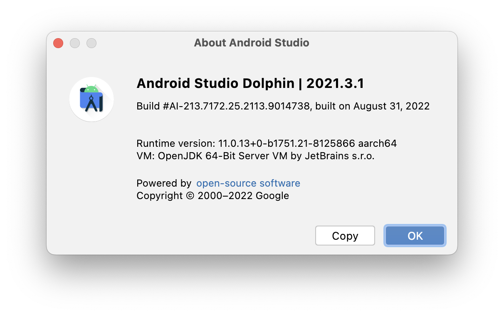
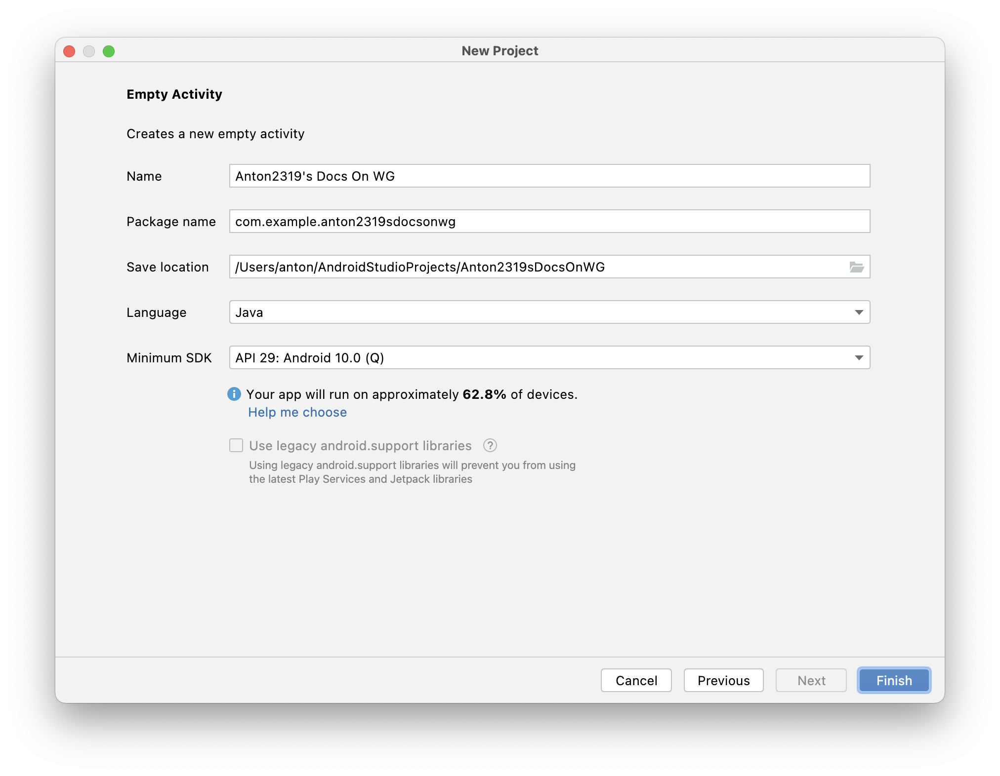
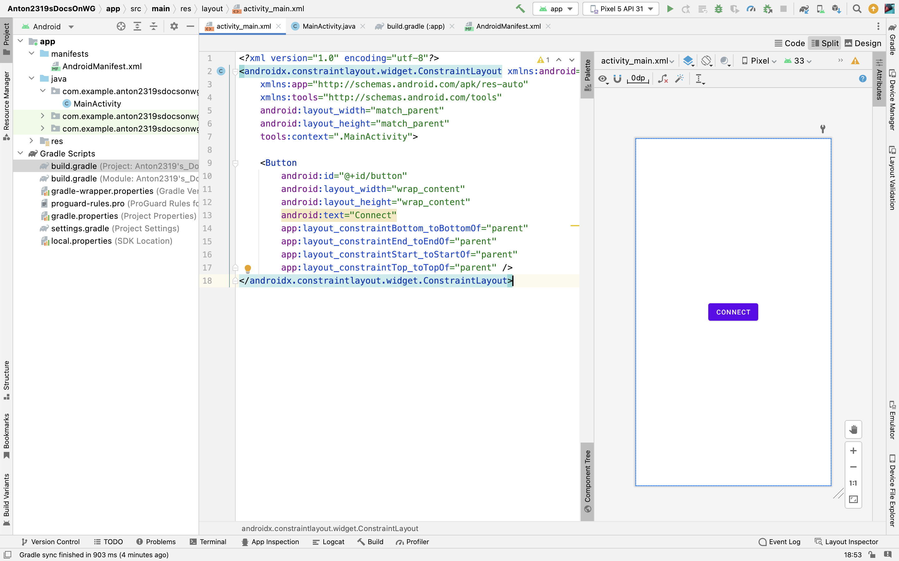
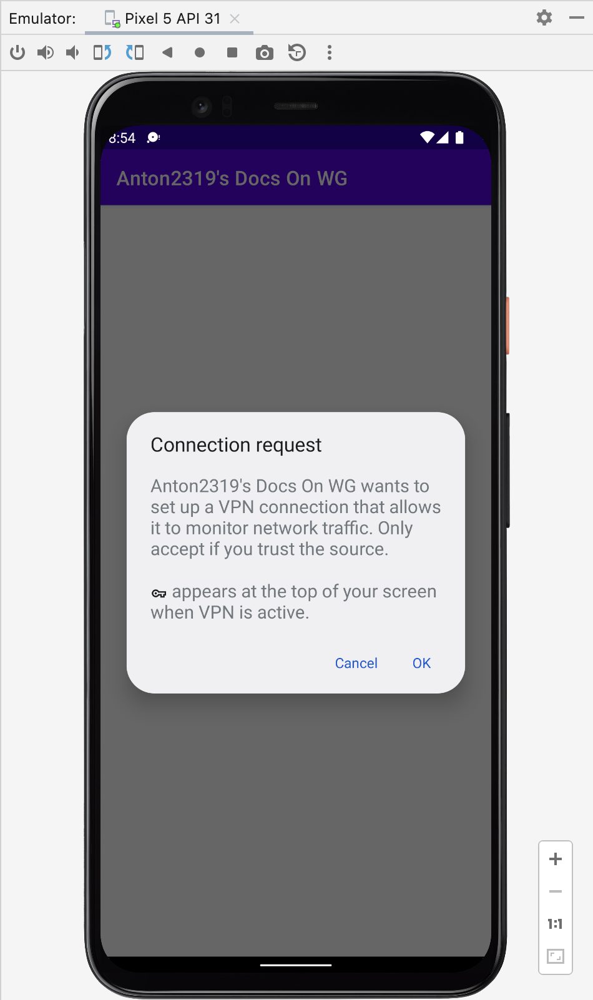
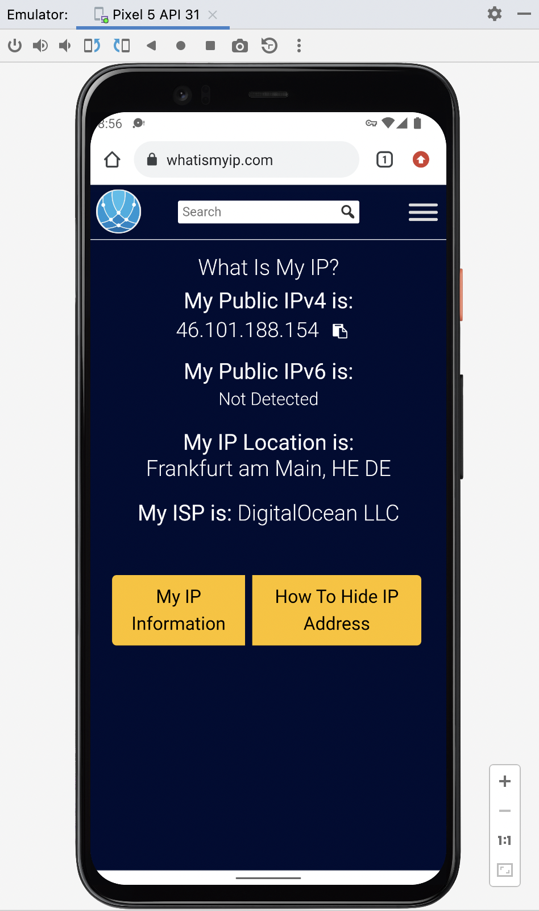

# Comprehendable guide on Wireguard Tunnel library for Android

I decided to write this short piece of documentation to make it easier for developers like me to actually use it, it took me over a week to go through official wireguard app to get an idea, how everything works, so I hope I can save you some time! :)

**Disclaimer**: I'm not a professional developer, do not have the proper coding skills, and overall my brain melts on any technical topic. Please don't attack me if I got the details wrong.

## Prerequisites
For that project I used Java programming language, because i don't know Kotlin, but due to a lot of similarities of Kotlin and Java, this guide will be relevant for Kotlin too. 
#### My IDE version:


#### Project settings:



## Installation and importing
Installation is done fairly easily, open the **build.gradle (app)** and add this line to dependencies:
`    implementation "com.wireguard.android:tunnel:1.0.20211029"
`
If you started with a blank project, it now should look like this:

```
dependencies {
    implementation "com.wireguard.android:tunnel:1.0.20211029"
    implementation 'androidx.appcompat:appcompat:1.5.1'
    implementation 'com.google.android.material:material:1.6.1'
    implementation 'androidx.constraintlayout:constraintlayout:2.1.4'
    testImplementation 'junit:junit:4.13.2'
    androidTestImplementation 'androidx.test.ext:junit:1.1.3'
    androidTestImplementation 'androidx.test.espresso:espresso-core:3.4.0'
}
```

Now, in order for our app to get to the internet, we should add permission request in **AndroidManifest.xml:**

```
<manifest ...>
    <uses-permission android:name="android.permission.INTERNET" />
</manifest>

```

Also, we need to specify to Android, that we would use vpn-service, and bind GoBackend to it:


```
<application ...>
	<service
        android:name="com.wireguard.android.backend.GoBackend$VpnService"
        android:exported="true"
        android:permission="android.permission.BIND_VPN_SERVICE">
        <intent-filter>
            <action android:name="android.net.VpnService" />
        </intent-filter>
    </service>
</application>
```
This short setup is already enough to import the library into the code. Let's try to do it to make our first connection!

## First connection

Our simple application will consist of 1 simple button - connect to server. Everything will be specified from the code, this includes endpoint ip, privatekey, publickey, and all other configuration parameters.

First, let's add a button to MainActivity. Open **MainActivity.xml**, and paste there this layout code:

```
<?xml version="1.0" encoding="utf-8"?>
<androidx.constraintlayout.widget.ConstraintLayout xmlns:android="http://schemas.android.com/apk/res/android"
    xmlns:app="http://schemas.android.com/apk/res-auto"
    xmlns:tools="http://schemas.android.com/tools"
    android:layout_width="match_parent"
    android:layout_height="match_parent"
    tools:context=".MainActivity">

    <Button
        android:id="@+id/button"
        android:layout_width="wrap_content"
        android:layout_height="wrap_content"
        android:text="Connect"
        android:onClick="connect"
        app:layout_constraintBottom_toBottomOf="parent"
        app:layout_constraintEnd_toEndOf="parent"
        app:layout_constraintStart_toStartOf="parent"
        app:layout_constraintTop_toTopOf="parent" />
</androidx.constraintlayout.widget.ConstraintLayout>
```
This will add a button that would make the layout look like this:



In **MainActivity.java**, we need to create connect method, that we specified in onClick property in layout xml. Copy/paste that code to create method:

```
public void connect(View v) {

}
```
In order to create a tunnel, WireGuard requires us to create our own class, that will implement Tunnel interface, let's do that. Create a new file, named **WgTunnel.java**, and paste this code into it:

```
import com.wireguard.android.backend.Tunnel;

public class WgTunnel implements Tunnel {
    @Override
    public String getName() {
        return "wgpreconf";
    }

    @Override
    public void onStateChange(State newState) {
    }
}
```

Now, let's paste a code to connect() method, that will create a vpn profile and establish a connection to a server. In **MainActivity.java**:

```
public void connect(View v) {
        Tunnel tunnel = new WgTunnel();
        Intent intentPrepare = GoBackend.VpnService.prepare(this);
        if(intentPrepare != null) {
            startActivityForResult(intentPrepare, 0);
        }
        Interface.Builder interfaceBuilder = new Interface.Builder();
        Peer.Builder peerBuilder = new Peer.Builder();
        Backend backend = new GoBackend(this);

        AsyncTask.execute(new Runnable() {
            @Override
            public void run() {
                try {
                    backend.setState(tunnel, UP, new Config.Builder()
                            .setInterface(interfaceBuilder.addAddress(InetNetwork.parse("10.0.3.200/32")).parsePrivateKey("redacted").build())
                            .addPeer(peerBuilder.addAllowedIp(InetNetwork.parse("0.0.0.0/0")).setEndpoint(InetEndpoint.parse("46.101.188.154:51820")).parsePublicKey("redacted").build())
                            .build());

                } catch (Exception e) {
                    e.printStackTrace();
                }
            }
        });
    }
```

Now, let's fire up our app, and see what happens!

Accept that:



As you see, it works perfectly fine!



## Next steps

Due to the nature of Android, it will destroy Activity and all the data stored inside to preserve RAM, so I recommend you to store Backend and Tunnel objects inside a singleton class. Let's create it:

```
public class PersistentConnectionProperties {
    private static PersistentConnectionProperties mInstance= null;

    private WgTunnel tunnel;
    private GoBackend backend;


    public WgTunnel getTunnel() {
        try {
            tunnel.getName();
        }
        catch (NullPointerException e) {
            tunnel = new WgTunnel();
        }
        return tunnel;
    }

    public GoBackend getBackend() {
        return backend;
    }

    public void setBackend(GoBackend backend) {
        this.backend = backend;
    }

    public static synchronized PersistentConnectionProperties getInstance() {
        if(null == mInstance){
            mInstance = new PersistentConnectionProperties();
        }
        return mInstance;
    }
}
```

You can now access its parameters by getting the instance of PersistentConnectionProperties. Here's an example:

`backend = PersistentConnectionProperties.getInstance().getBackend();`

Update your code to reflect these changes. Put backend initialization to onCreate method:

```
@Override
    protected void onCreate(Bundle savedInstanceState) {
        super.onCreate(savedInstanceState);
        setContentView(R.layout.activity_main);

        try {
            backend.getRunningTunnelNames();
        }
        catch (NullPointerException e) {
            // backend cannot be created without context
            PersistentConnectionProperties.getInstance().setBackend(new GoBackend(this));
            backend = PersistentConnectionProperties.getInstance().getBackend();
        }
    }
```

### Tunnel Model
To further organize the code, create a TunnelModel that will store the configuration:

```
public class TunnelModel {
    public String privateKey;
    public String IP;
    public String dns;
    public String endpoint;
    // add allowed ips here calling the ArrayList add() method
    public Collection<InetNetwork> allowedIPs = new ArrayList<InetNetwork>();
    public String url;
    public String publicKey;
}
```

Update your connection code to reflect the changes:

```
backend.setState(tunnel, UP, new Config.Builder()
                                .setInterface(interfaceBuilder.addAddress(InetNetwork.parse(tunnelModel.IP)).parsePrivateKey(tunnelModel.privateKey).build())
                                .addPeer(peerBuilder.addAllowedIps(tunnelModel.allowedIPs).setEndpoint(InetEndpoint.parse(tunnelModel.endpoint)).parsePublicKey(tunnelModel.publicKey).build())
                                .build());
```

### DataSource, TunnelDecoder

If you have some kind of data source (API, manual configuration, etc) you can separate it from your main code into separate classes.
Let's create a sample DataSource class and hardcode the data into it:

```
public class DataSource {

    private static final String JSON_STRING = "{\"user_info\":{\"username\":\"redacted\",\"password\":\"redacted\",\"vpn-name\":\"redacted\",\"PrivateKey\":\"base64=\",\"Address\":\"10.0.0.2/24\",\"DNS\":\"8.8.8.8\",\"PublicKey\":\"redacted=\",\"AllowedIPs\":\"0.0.0.0/1, 128.0.0.0/1, ::/1, 8000::/1\",\"Endpoint\":\"redacted:51820\",\"status\":\"Active\",\"vpnConnection\":true},\"server_info\":{\"url\":\"10.0.0.1\"}}";

    public static TunnelModel getTunnelModel() {
        return TunnelDecoder.decode(JSON_STRING);
    }

}
```
Now let's decode our JSON to TunnelModel via TunnelDecoder:

Install Gson into your project by adding this line to your gradle file: 

`implementation 'com.google.code.gson:gson:2.8.4'`

Create a new class that will utilize Gson to decode our sample JSON string:

```
import com.google.gson.Gson;
import com.google.gson.JsonObject;
import com.wireguard.config.InetNetwork;
import com.wireguard.config.ParseException;

public class TunnelDecoder {

    public static TunnelModel decode(String jsonString) {
        Gson gson = new Gson();
        JsonObject json = gson.fromJson(jsonString, JsonObject.class);

        TunnelModel model = new TunnelModel();
        model.privateKey = json.get("user_info").getAsJsonObject().get("PrivateKey").getAsString();
        model.IP = json.get("user_info").getAsJsonObject().get("Address").getAsString();
        model.dns = json.get("user_info").getAsJsonObject().get("DNS").getAsString();
        model.endpoint = json.get("user_info").getAsJsonObject().get("Endpoint").getAsString();
        String allowedIPs[] = json.get("user_info").getAsJsonObject().get("AllowedIPs").getAsString().split(",\\s*");
        for (String ip: allowedIPs) {
            try {
                model.allowedIPs.add(InetNetwork.parse(ip));
            }
            catch (ParseException e) {
                e.printStackTrace();
            }
        }
        model.publicKey = json.get("user_info").getAsJsonObject().get("PublicKey").getAsString();
        model.url = json.get("server_info").getAsJsonObject().get("url").getAsString();

        return model;
    }

}
```

And now you may extract all your data conveniently:

`TunnelModel tunnelModel = DataSource.getTunnelModel();`


### Disconnecting

As you may notice, there's no way for our app to disconnect from the server.
Here's how you can implement it: 

```
AsyncTask.execute(new Runnable() {
            @Override
            public void run() {
                try {
                    if (backend.getState(PersistentConnectionProperties.getInstance().getTunnel()) == UP) {
                        backend.setState(tunnel, DOWN, null);
                    } else {
                        backend.setState(tunnel, UP, new Config.Builder()
                                .setInterface(interfaceBuilder.addAddress(InetNetwork.parse(tunnelModel.IP)).parsePrivateKey(tunnelModel.privateKey).build())
                                .addPeer(peerBuilder.addAllowedIps(tunnelModel.allowedIPs).setEndpoint(InetEndpoint.parse(tunnelModel.endpoint)).parsePublicKey(tunnelModel.publicKey).build())
                                .build());
                    }
                } catch (Exception e) {
                    e.printStackTrace();
                }
            }
        });
```

Now if you click the button for the second time, it will shutdown the tunnel

**Keep in mind that you need to store your backend, if you lose your reference to backend and tunnel objects there's no way to terminate a connection aside from forcestopping the app**

Here's the updated MainActivity after all the tweaks applied:

```
public class MainActivity extends AppCompatActivity {

    Backend backend;

    @Override
    protected void onCreate(Bundle savedInstanceState) {
        super.onCreate(savedInstanceState);
        setContentView(R.layout.activity_main);

        try {
            backend.getRunningTunnelNames();
        }
        catch (NullPointerException e) {
            // backend cannot be created without context
            PersistentConnectionProperties.getInstance().setBackend(new GoBackend(this));
            backend = PersistentConnectionProperties.getInstance().getBackend();
        }
    }

    public void connect(View v) {
        TunnelModel tunnelModel = DataSource.getTunnelModel();
        Tunnel tunnel = PersistentConnectionProperties.getInstance().getTunnel();

        Intent intentPrepare = GoBackend.VpnService.prepare(this);
        if(intentPrepare != null) {
            startActivityForResult(intentPrepare, 0);
        }
        Interface.Builder interfaceBuilder = new Interface.Builder();
        Peer.Builder peerBuilder = new Peer.Builder();

        AsyncTask.execute(new Runnable() {
            @Override
            public void run() {
                try {
                    if (backend.getState(PersistentConnectionProperties.getInstance().getTunnel()) == UP) {
                        backend.setState(tunnel, DOWN, null);
                    } else {
                        backend.setState(tunnel, UP, new Config.Builder()
                                .setInterface(interfaceBuilder.addAddress(InetNetwork.parse(tunnelModel.IP)).parsePrivateKey(tunnelModel.privateKey).build())
                                .addPeer(peerBuilder.addAllowedIps(tunnelModel.allowedIPs).setEndpoint(InetEndpoint.parse(tunnelModel.endpoint)).parsePublicKey(tunnelModel.publicKey).build())
                                .build());
                    }
                } catch (Exception e) {
                    e.printStackTrace();
                }
            }
        });
    }
}
```

## Class overview

Now, let's overview some of the common classes and interfaces that are part of the wireguard library.

### GoBackend

Class, that provides you with WireGuard backend in userspace. This is a vpn-service implementation, so it requires permission from the user, and consumes a lot of battery power when connected to a server.

### WgQuickBackend

Kernel-space implementation of WireGuard backend. Much more stable and efficient on resources, but requires root access.

### Tunnel (Interface)

Represents a Wireguard tunnel. Self-explanatory.

### Backend (Interface)

If you are fearless, implement your own WireGuard backend with this interface, but considering that you are reading this article, you are probably not. :)

### Config

Represents fully baked wireguard config, that you could pass to backend.

### Config.Builder

Builds you a Config.

### com.wireguard.crypto (package)

Everything you need to work with keys and keypairs.

For advanced class documentation I recommend you to visit JavaDoc for WireGuard: [https://javadoc.io/doc/com.wireguard.android/tunnel/latest/index.html](https://javadoc.io/doc/com.wireguard.android/tunnel/latest/index.html) 

## Anything else??

I might miss something, but remember, this is a short guide for those, who won't bother to read code of the official implementation. Got something to add? Email me to [anton_2319@outlook.com](mailto:anton_2319@outlook.com), DM on IG: [@anton_2319](https://www.instagram.com/anton_2319/), Twitter: [@AntonRudkovskij](https://twitter.com/AntonRudkovskij), or Telegram: [@infinitewanderer](https://t.me/infinitewanderer)
Thanks for reading this!
